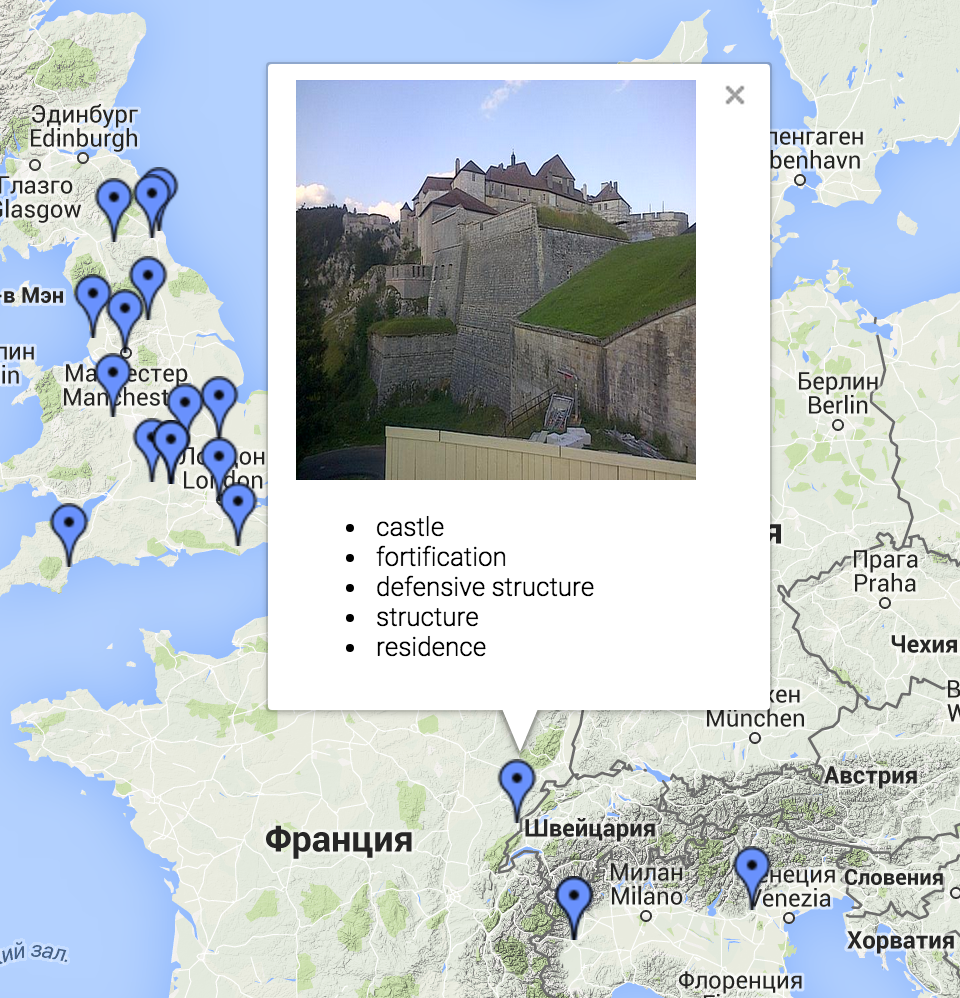

# Twitter image classification

## Overview

Originally this project was built in a quite short period of time during Microsoft Research Russia Summer School“Doing Research in the Cloud”. The main idea of this project is to collect, analyze and visualize data from social network Twitter.

The first version was build on Microsoft Azure platform and heavily utilises it’s tools such as Queue Service, Blob storage service, Table service, SQL Azure Database, Bing Maps API. The system was launched on three trial accounts provided by Microsoft for school participants. The source code of this version was lost just as web access to deployed version.

The second version was build with using Celery, a distributed task queue – system to process messages while providing operations with the tools required to maintain such a system. In both cases to use Twitter API – subscribe and receive tweets with both image and geotag, a Python library Tweepy was used.

## Structure of the project

* Twitter subscriber (src/classify_tweets/tweets.py)
* Image classification (src/run.sh)
* Front-end (src/runserver.py)

## TODO

In the current time there is no proper deploy and start options.